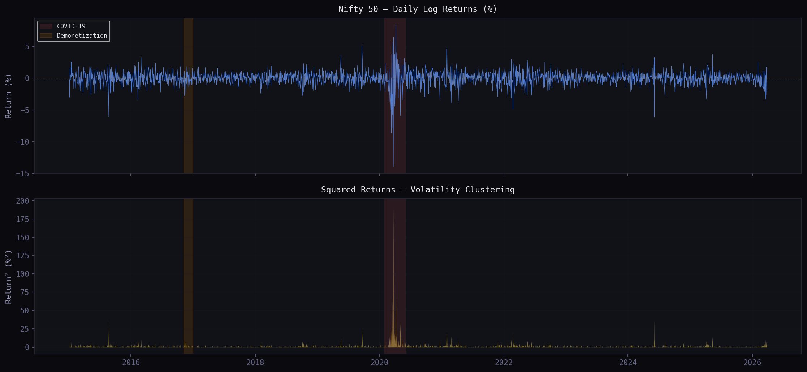
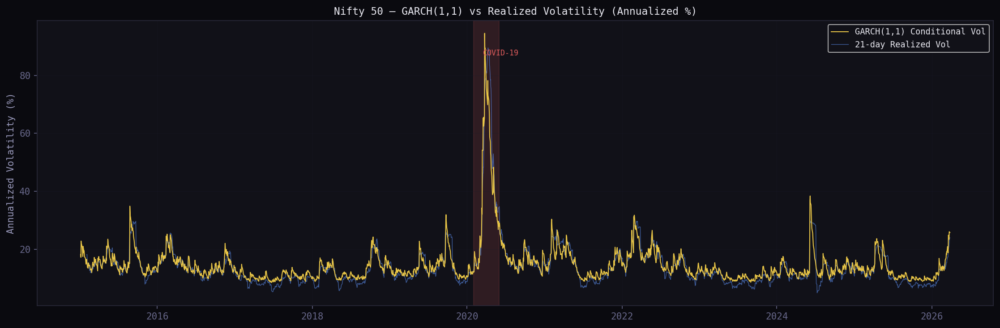
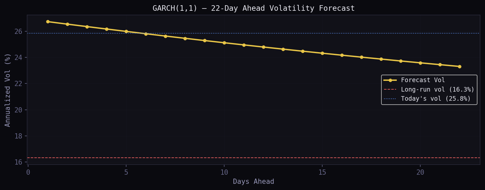
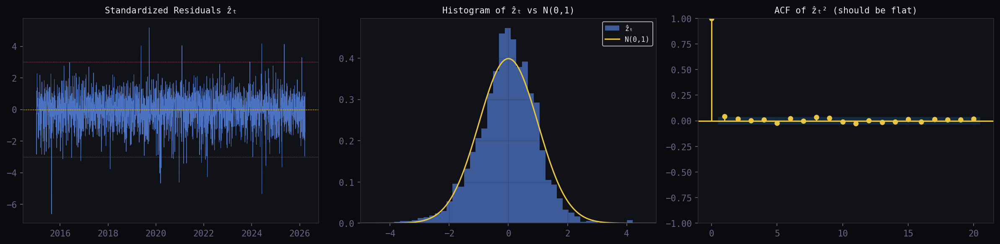

# GARCH Volatility Modelling — Nifty 50

Conditional volatility estimation on the Nifty 50 index using GARCH(1,1), with both Normal and Student-t error distributions, a 22-day forward forecast, and dynamic Value-at-Risk computation.

---

## Context

The [Nifty 50 Risk Metrics](../nifty50-var/) project computed VaR using Historical and EWMA methods. Both treat volatility as either fixed or slowly-decaying. This project goes a step further: **volatility itself is the variable being modelled**.

GARCH (Generalised Autoregressive Conditional Heteroskedasticity) captures a well-documented empirical fact about equity returns — **volatility clusters**. Calm periods are followed by calm periods; turbulent periods are followed by turbulent periods. A static variance estimate misses this entirely.

---

## What it models

| Model | Distribution | Log-Likelihood | AIC | Notes |
|---|---|---|---|---|
| GARCH(1,1) | Normal | −3544.12 | 7096.25 | Baseline |
| GARCH(1,1) | Student-t | −3476.18 | **6962.36** | **Preferred** — captures fat tails |

The Student-t model wins by **ΔAIC = 133.89 points** — a decisive margin. Nifty 50 returns have excess kurtosis of ~20 (vs. 0 for Normal), so modelling the tail behaviour correctly matters.

---

## The Math

**Variance equation:**

$$\sigma_t^2 = \omega + \alpha \cdot \varepsilon_{t-1}^2 + \beta \cdot \sigma_{t-1}^2$$

- **ω (omega)** — base (unconditional) variance level
- **α (alpha)** — sensitivity to yesterday's shock (ARCH term)
- **β (beta)** — inertia from yesterday's variance (GARCH term)
- **α + β** — persistence; must be < 1 for stationarity

**Mean reversion of forecasts:**

$$E[\sigma^2_{t+h}] = \bar{\sigma}^2 + (\alpha + \beta)^{h-1}(\sigma^2_{t+1} - \bar{\sigma}^2)$$

Forecasts decay geometrically back to the long-run variance target. Higher persistence → slower decay.

---

## Estimated Parameters (Student-t model)

| Parameter | Value | Interpretation |
|---|---|---|
| ω (omega) | 0.0261 | Base variance |
| α (alpha) | 0.0832 | Shock reactivity |
| β (beta) | 0.8870 | Volatility inertia |
| **α + β** | **0.9702** | Very high persistence |
| Half-life of shock | ~23 trading days | Time for vol to decay halfway back |
| Long-run annual vol | **16.33%** | Equilibrium target |
| Degrees of freedom (ν) | **6.64** | Fat tails — far from Normal (ν → ∞) |

---

## Key Results

**22-Day Volatility Forecast** (from March 2026)

| Horizon | Annualised Vol |
|---|---|
| Day 1 | 26.73% |
| Day 5 | 25.99% |
| Day 10 | 25.12% |
| Day 22 | 23.31% |
| Long-run target | 16.33% |

Volatility is elevated relative to its long-run level and mean-reverting — the forecast converges gradually downward.

**1-Day VaR (99% confidence)**

| Model | VaR |
|---|---|
| GARCH + Normal | 3.724% |
| GARCH + Student-t | **4.583%** |
| Difference | +0.859% |

The Normal model **underestimates tail risk by 86 bps** at 99% confidence. In a ₹10 Cr portfolio, that's a ₹8.6L gap in the risk estimate — material for any risk desk.

---

## Visualisations

**Returns & Volatility Clustering**



Squared returns reveal the clustering structure — the 2020 COVID crash is clearly visible as a volatility spike.

**Conditional vs Realised Volatility**



The GARCH conditional volatility (blue) tracks the 21-day realised volatility (orange) closely, while responding more sharply to sudden shocks.

**22-Day Forward Forecast**



Mean reversion in action — elevated current volatility decays toward the 16.33% long-run target over the forecast horizon.

**Model Diagnostics**



Standardised residuals ẑₜ = εₜ/σₜ are approximately iid. Ljung-Box test on ẑₜ² passes at lags 5 and 10 — no remaining ARCH structure left in the residuals.

---

## Data

- **Source:** Yahoo Finance (`^NSEI`)
- **Period:** January 2, 2015 — March 27, 2026
- **Observations:** 2,765 log returns
- **Returns:** Log returns scaled to % (`100 × ln(Pₜ/Pₜ₋₁)`) for numerical stability in MLE

**Return statistics:**

| Stat | Value |
|---|---|
| Mean daily return | 0.036% |
| Daily std dev | 1.032% |
| Annualised vol | 16.38% |
| Skewness | −1.34 (left tail) |
| Excess kurtosis | 19.92 (very fat tails) |
| Worst day | −13.90% |
| Best day | +8.40% |

---

## How to Run

```bash
pip install arch yfinance numpy pandas scipy matplotlib statsmodels
jupyter notebook GARCH_Nifty_Implementation.ipynb
```

Data is fetched live from Yahoo Finance. No static files required.

---

## Files

| File | Role |
|---|---|
| `GARCH_Nifty_Implementation.ipynb` | Full implementation — data, fitting, forecasting, VaR, diagnostics |
| `images/nifty_returns.png` | Return series and squared returns plot |
| `images/nifty_garch_vol.png` | Conditional vs realised volatility |
| `images/nifty_garch_forecast.png` | 22-day volatility forecast term structure |
| `images/nifty_diagnostics.png` | Standardised residual diagnostics |

---

## What's Next

- **GJR-GARCH / EGARCH** — capture the leverage effect: negative return shocks spike volatility more than equivalent positive shocks (empirically documented in equities)
- **VaR Backtesting** — Kupiec test for unconditional coverage; Christoffersen test for independence of exceptions
- **Rolling out-of-sample forecast** — evaluate forecast accuracy over expanding/rolling windows
